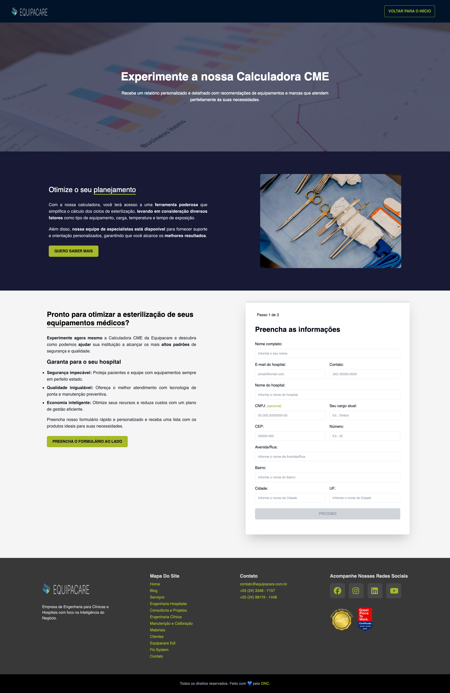

<h1 align="center">
  CME Landing page
</h1>

## 👨🏻‍💻 About

The project aims to transform an Excel spreadsheet used for sizing sterilization equipment in hospitals into an interactive online tool that can capture qualified leads and map future clients, while handling the collection and integration of data on hospitals under construction in Brazil.

I developed a Landing page to collect precising and clear information about client registrations, thus mapping future clients and obtaining information about new hospitals under construction.

Check the Manager Portal repository by [clicking here](https://github.com/eliasacneto/web-admin-cme)

### Technologies Used

- React.js: A React framework for server-side rendering and routing.
- TypeScript: A programming language to add static typing to the code.
- TailwindCSS: A CSS framework for rapid and responsive styling.
- ShadcnUI: A collection of reusable components.

## 💻 Features

- Display of information divided into sections.
- Capture of qualified leads through a freemium system.
- Responsiveness for mobile devices.

## 🖥️ Screenshots:

<div align="center" style="display: flex; gap:1px">
  
</div>

## ⚙️ How to Run the Application:

You will need to have [Node.js](https://nodejs.org/en) installed to use npm commands and [Git](https://git-scm.com/) installed on your machine.

Clone the project:

```bash
  git clone https://github.com/eliasacneto/web-cme
```

Navigate to the project directory:

```bash
  cd web-admin-cme
```

Install the dependencies:

```bash
  npm install
```

Start the server:

```bash
  npm run dev
```
